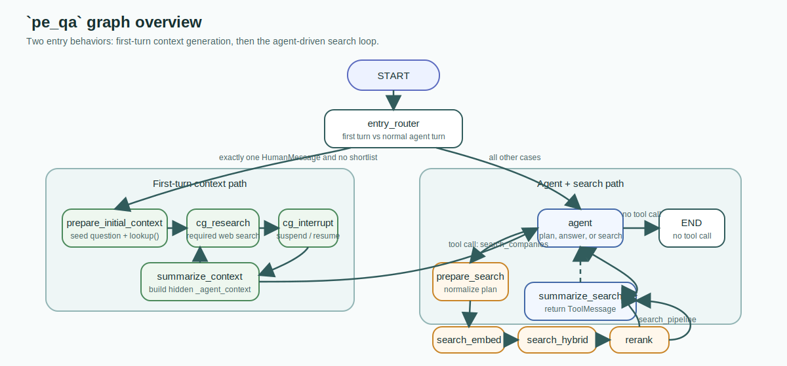
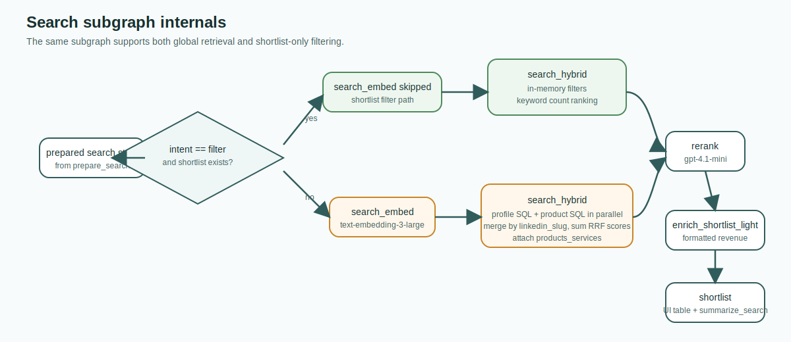
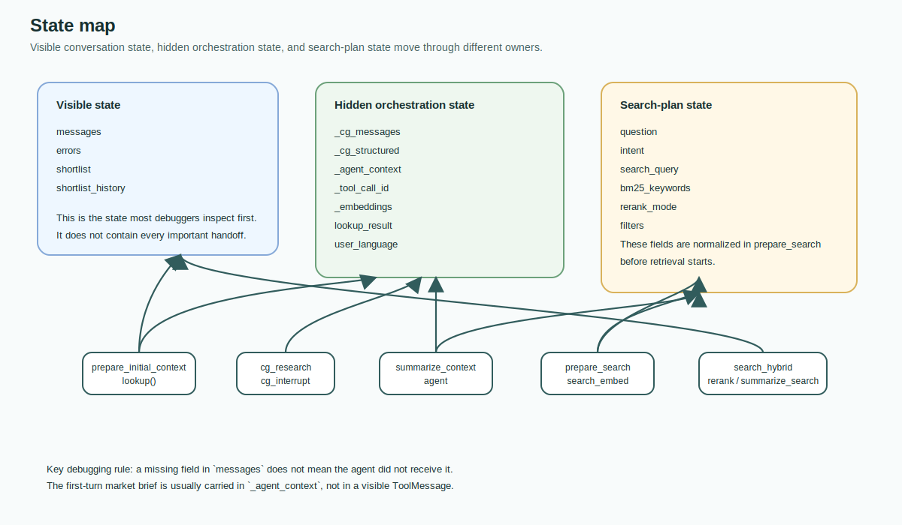
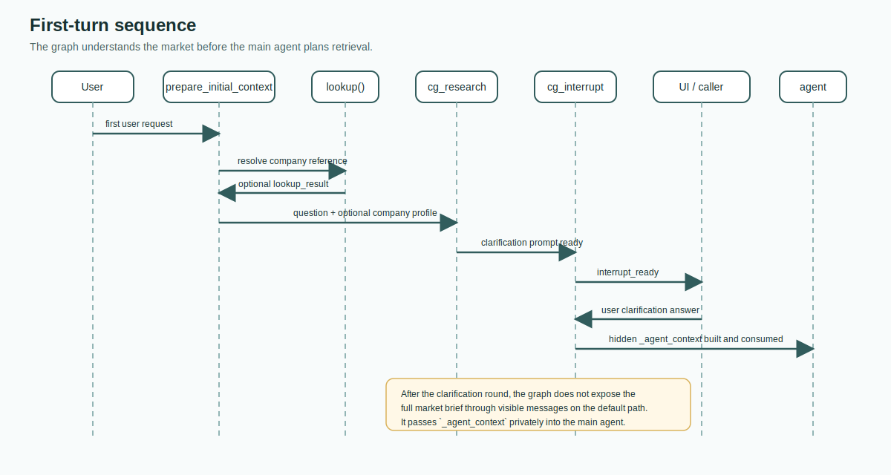
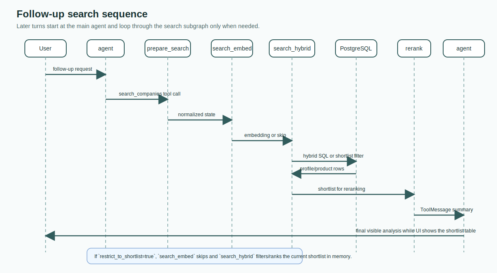
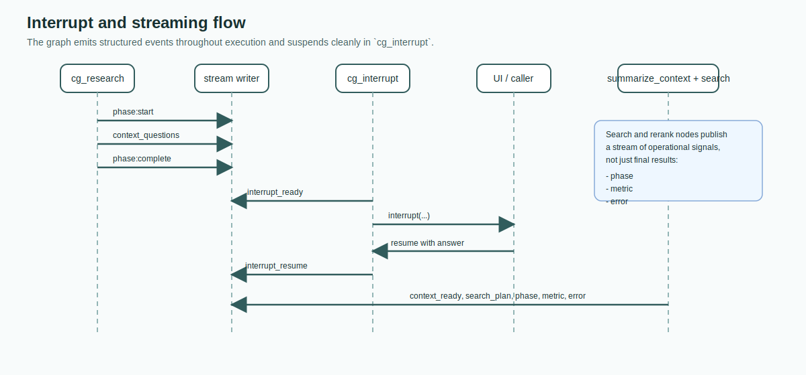

# `pe_qa` Company Research Graph

This document explains how the `pe_qa` LangGraph works end to end.

`pe_qa` is the company research graph that turns a user request into a company shortlist for competitor search, comparable-company discovery, or early target sourcing. It is not the `pe_deal` graph. `pe_deal` starts later, once a target universe already exists and the workflow pivots to buyer/deal discovery.

The intended reader is a new engineer who needs to understand, debug, or extend `pe_qa` without reverse-engineering the codebase from scratch.

## Code Map

The graph is spread across a small set of files:

- Graph topology: [`pe_qa_graph/graph.py`](pe_qa_graph/graph.py)
- State schema and reducers: [`pe_qa_graph/state.py`](pe_qa_graph/state.py)
- Main agent, search preparation, and summarizers: [`pe_qa_graph/nodes/agent.py`](pe_qa_graph/nodes/agent.py)
- Context generator and interrupt flow: [`pe_qa_graph/nodes/context_generator.py`](pe_qa_graph/nodes/context_generator.py)
- Hybrid retrieval: [`pe_qa_graph/nodes/search.py`](pe_qa_graph/nodes/search.py)
- LLM reranking: [`pe_qa_graph/nodes/rerank.py`](pe_qa_graph/nodes/rerank.py)
- First-turn company lookup: [`pe_qa_graph/nodes/lookup.py`](pe_qa_graph/nodes/lookup.py)
- OpenAI and embedding client helpers: [`pe_qa_graph/llm/client.py`](pe_qa_graph/llm/client.py)
- Shared SQL templates: [`shared/db/sql_templates.py`](shared/db/sql_templates.py)

## Diagram Set

The Mermaid files are the editable sources of truth. The SVG files are committed so the documentation remains readable even where Mermaid rendering is unavailable.

| Diagram | SVG | Mermaid source |
| --- | --- | --- |
| Full graph overview | [graph-overview.svg](docs/company-research/assets/graph-overview.svg) | [graph-overview.mmd](docs/company-research/diagrams/graph-overview.mmd) |
| First-turn sequence | [first-turn-sequence.svg](docs/company-research/assets/first-turn-sequence.svg) | [first-turn-sequence.mmd](docs/company-research/diagrams/first-turn-sequence.mmd) |
| Follow-up search sequence | [follow-up-search-sequence.svg](docs/company-research/assets/follow-up-search-sequence.svg) | [follow-up-search-sequence.mmd](docs/company-research/diagrams/follow-up-search-sequence.mmd) |
| Search subgraph internals | [search-subgraph.svg](docs/company-research/assets/search-subgraph.svg) | [search-subgraph.mmd](docs/company-research/diagrams/search-subgraph.mmd) |
| State map | [state-map.svg](docs/company-research/assets/state-map.svg) | [state-map.mmd](docs/company-research/diagrams/state-map.mmd) |
| Interrupt and streaming flow | [interrupt-streaming.svg](docs/company-research/assets/interrupt-streaming.svg) | [interrupt-streaming.mmd](docs/company-research/diagrams/interrupt-streaming.mmd) |

## What `pe_qa` Owns

At a high level, `pe_qa` owns four jobs:

1. Understand the user's target market, often on the first turn before any database search happens.
2. Convert the conversation into a structured search plan with a semantic query, BM25 keywords, and a small set of supported structured filters.
3. Retrieve and rerank companies from the proprietary database.
4. Return a concise textual analysis while the full shortlist is shown separately in the UI.

It does not own downstream buyer/deal derivation. That belongs to `pe_deal`.

## Mental Model

There are two distinct execution paths.

### Path A: First-turn context generation

On the very first user turn, the graph intentionally bypasses the main agent at entry. It first builds market context, asks clarification questions, and only then hands hidden context to the agent.



This path exists because a first message is often too ambiguous for direct retrieval. The graph therefore tries to understand the market before it spends any retrieval budget.

### Path B: Later agent-driven search and refinement

Once the graph already has conversation context or a shortlist, it routes directly to the main agent. The agent decides whether to answer directly or call the internal `search_companies` tool, which triggers the search subgraph.

The main design consequence is simple:

- The first turn is context-first.
- Later turns are agent-first.

## Topology and Routing

The graph is defined in [`pe_qa_graph/graph.py`](pe_qa_graph/graph.py). It has:

- one root graph
- one compiled subgraph called `search_pipeline`
- one forced first-turn branch
- one tool-driven search branch

The entry condition is deliberately narrow:

- the conversation must contain exactly one `HumanMessage`
- there must be no current shortlist

If both are true, `entry_router` sends execution to `prepare_initial_context`. Otherwise it sends execution to `agent`.

## Node-by-Node Walkthrough

The table below is the shortest correct mental model of the graph.

| Node | Why it exists | Main reads | Main writes |
| --- | --- | --- | --- |
| `entry_router` | Detect whether this is a first-turn market-discovery request or a normal agent turn. | `messages`, `shortlist` | no durable state |
| `prepare_initial_context` | Seed the first-turn flow and try to resolve the query to a known company profile before research starts. | latest user message, current shortlist | `question`, `_cg_messages`, `_cg_structured`, optional `lookup_result` |
| `cg_research` | Run the context generator with required web search and structured output. | `question`, `lookup_result` | `_cg_messages`, `_cg_structured`, `user_language` |
| `cg_interrupt` | Surface clarification questions to the UI and suspend the graph until the user answers. | `_cg_messages` | appends the user's clarification answer to `_cg_messages` |
| `summarize_context` | Convert the context-generator transcript into hidden state for the main agent. | `_cg_messages`, `_cg_structured`, `_tool_call_id` | `_agent_context`, optionally a `ToolMessage` |
| `agent` | Plan, answer, and decide whether a new search is needed. | `messages`, `_agent_context`, `shortlist` | AI response in `messages`, cleared `_agent_context`, `user_language` |
| `prepare_search` | Normalize tool-call args into the internal search state shape. | latest AI tool call, current shortlist | `question`, `intent`, `search_query`, `bm25_keywords`, `rerank_mode`, `filters`, `_tool_call_id`, `shortlist_history` |
| `search_embed` | Generate embeddings for semantic retrieval, unless the request is shortlist-only filtering. | `search_query`, `intent`, `shortlist` | `_embeddings`, optional `errors` |
| `search_hybrid` | Retrieve companies either from the DB or from the current shortlist. | `_embeddings`, `bm25_keywords`, `filters`, `shortlist`, `intent` | `shortlist`, optional `errors` |
| `rerank` | Verify relevance with an LLM, keep/discard per company, then enrich the shortlist lightly for UI display. | `shortlist`, `question`, `rerank_mode` | filtered `shortlist`, optional `errors` |
| `summarize_search` | Create the `ToolMessage` that tells the agent what happened without dumping the whole table again. | `shortlist`, `_tool_call_id`, `errors` | `ToolMessage` in `messages` |

### `entry_router`

Purpose: decide whether the graph should do market understanding first or whether it can let the agent act immediately.

Why it matters:

- It makes first-turn behavior deterministic.
- It prevents the agent from guessing a search plan too early.
- It keeps later turns fast because they skip the context-generator overhead.

### `prepare_initial_context`

Purpose: set up the first-turn context path and optionally attach a known company profile.

What it really does:

- copies the latest user message into `question`
- clears stale context-generator scratch fields
- calls `lookup()` directly, without routing through a separate graph node

The embedded `lookup()` helper checks:

1. the current shortlist
2. direct `ILIKE` lookup in `company_linkedin_data`
3. trigram similarity fallback
4. LLM name normalization fallback

If a company is found, the result is enriched with legal and financial helper data before being passed into the context generator.

### `cg_research`

Purpose: produce a market brief, clarification questions, and an internal market summary in one shot.

Implementation details:

- It uses the Responses API through `web_search_reasoning_parse(...)`.
- The model is hardcoded to `gpt-5.2`.
- `web_search_preview` is required, not optional.
- The output is parsed into the `CGResearchOutput` schema.

This node writes two layers of data:

- `_cg_messages`: a synthetic mini-conversation between the original user request and the generated clarification prompt
- `_cg_structured`: a structured market summary, clarification question list, and company-card snapshot

This separation is useful later:

- `_cg_messages` preserves the exact clarification exchange
- `_cg_structured` gives the agent a denser hidden market brief

### `cg_interrupt`

Purpose: stop the graph and let the user answer the clarification questions.

The node:

- emits `interrupt_ready`
- calls `interrupt(...)`
- resumes when the caller provides an answer
- appends that answer into `_cg_messages`

This is the only place where the graph intentionally suspends execution for user input.

### `summarize_context`

Purpose: prepare hidden context for the main agent after the clarification round.

What gets packed into `_agent_context`:

- a verbatim transcript of the context-generator exchange
- an internal market context block containing:
  - target market summary
  - market summary
  - company card

Current behavior:

- On the normal first-turn path, `_tool_call_id` is empty.
- That means `summarize_context` stores the context only in hidden private state.
- No visible `ToolMessage` is injected in that path.

The file also supports a `ToolMessage`-based handoff when `_tool_call_id` is set, but the default first-turn route does not currently use that branch.

### `agent`

Purpose: decide whether to answer directly or trigger a search, then produce the final user-facing analysis after any tool result.

The agent runs in two modes:

- planning mode: tool use allowed
- answer mode: tool use disabled once the last visible message is a `ToolMessage`

Important design detail:

- `_is_post_search_tool_result(...)` only checks whether the last message is a `ToolMessage`
- it does not inspect the tool name

So any trailing `ToolMessage` flips the agent into final-answer mode.

The prompt in [`pe_qa_graph/nodes/agent.py`](pe_qa_graph/nodes/agent.py) forces several behaviors:

- always answer in the latest user language
- use `search_companies` for search or shortlist refinement
- make an explicit `restrict_to_shortlist` choice on every search tool call
- keep filter constraints out of `semantic_query` and `bm25_keywords` when those filters already exist structurally

### `prepare_search`

Purpose: translate the agent's tool arguments into internal graph state.

This node is where the high-level search plan becomes executable state.

It normalizes:

- `search_context` into `question`
- `semantic_query` into `search_query`
- `bm25_keywords`
- `rerank_mode`
- `linkedin_employee_filter`
- `is_pe_backed`
- `country_code`

It also:

- converts `restrict_to_shortlist` into `intent = "filter"` or `intent = "sourcing"`
- snapshots the current shortlist into `shortlist_history` before the next search starts
- keeps only the latest 5 shortlist snapshots
- emits a `search_plan` custom event for observability

### `search_pipeline`

Purpose: run the actual retrieval and ranking pipeline.

The compiled subgraph is:

- `search_embed`
- `search_hybrid`
- `rerank`

See the dedicated search section below for the internal mechanics.

### `summarize_search`

Purpose: give the agent a compact description of what the pipeline found.

The summary intentionally avoids re-listing the whole shortlist because the UI already shows the table separately. Instead, it tells the agent:

- how many companies were found
- that the full list is visible elsewhere
- the top 10 rows with enough context to support a short analysis

This is the handoff that lets the final agent answer stay concise.

## Search Subgraph Internals



The search subgraph contains the real retrieval logic. It has two modes.

### Normal retrieval path

This path is used for a new/global search.

1. `search_embed` generates one embedding from `search_query`.
2. `search_hybrid` builds two BM25 queries:
   - profile BM25 over `company_linkedin_data`
   - product BM25 over `company_products`
3. It runs both hybrid SQL queries in parallel.
4. It merges the resulting companies by `linkedin_slug`, summing RRF scores across profile and product matches.
5. It enriches the merged shortlist with `products_services`.
6. `rerank` verifies relevance in LLM batches and injects `rerank_reason`.
7. `enrich_shortlist_light(...)` adds a formatted revenue field from `fund_portfolio`.

### Shortlist-filter path

This path is used when the agent sets `restrict_to_shortlist=true` and a shortlist already exists.

The behavior is intentionally different:

- `search_embed` skips embedding entirely.
- `search_hybrid` does not hit PostgreSQL for hybrid retrieval.
- Structured filters are applied in memory against the current shortlist.
- BM25 keywords are used as a lightweight substring-based ranking signal, not ParadeDB BM25.
- The filtered shortlist still goes through the same reranker.

This distinction matters when debugging relevance or performance. A follow-up filter request is not equivalent to a fresh database search.

### Hybrid retrieval mechanics

The normal hybrid path uses two shared SQL templates from [`shared/db/sql_templates.py`](shared/db/sql_templates.py):

- `HYBRID_SEARCH_PROFILES`
- `HYBRID_SEARCH_PRODUCTS`

Both queries combine:

- vector retrieval
- ParadeDB BM25 retrieval
- reciprocal rank fusion

Current constants:

- `RRF_K = 60.0`
- `VECTOR_WEIGHT = 1.5`
- `BM25_WEIGHT = 0.7`
- `VECTOR_DISTANCE_THRESHOLD = 0.90`
- `BM25_SCORE_THRESHOLD = 1.0`

The product path has a subtle implementation detail:

- product vectors are retrieved from `company_products`
- company-level structured filters are applied only after the join back to `company_linkedin_data`

That is why the code builds separate filter strings for profile and product search.

### Reranking

Reranking is handled in [`pe_qa_graph/nodes/rerank.py`](pe_qa_graph/nodes/rerank.py).

Key behaviors:

- model: `gpt-4.1-mini`
- batch size: 15 companies
- output: keep/discard decision with a reason per company
- failure mode: keep the whole batch on rerank error

The reranker preserves the incoming shortlist order. It does not resort companies; it only removes rows and adds `rerank_reason`.

## State Lifecycle



The state schema lives in [`pe_qa_graph/state.py`](pe_qa_graph/state.py). The fields are easier to understand if grouped by role.

### Visible conversation state

| Field | Producer | Consumer | Notes |
| --- | --- | --- | --- |
| `messages` | agent, `summarize_search`, sometimes `summarize_context` | agent, routing helpers | Uses `add_messages`, so updates append instead of replace |
| `errors` | search and rerank nodes | `summarize_search`, observability | Replaced, not appended |

### Hidden context-generator state

| Field | Producer | Consumer | Notes |
| --- | --- | --- | --- |
| `_cg_messages` | `cg_research`, `cg_interrupt` | `summarize_context` | Uses a special reducer where `[]` means reset |
| `_cg_structured` | `cg_research` | `summarize_context` | Structured market context |
| `_agent_context` | `summarize_context` | `agent` | Hidden context, not shown directly to the user |
| `lookup_result` | `prepare_initial_context` via `lookup()` | `cg_research` | First-turn company profile seed |
| `user_language` | `cg_research`, `agent` | `agent`, prompt injection | Used to force response language |

### Search-plan state

| Field | Producer | Consumer | Notes |
| --- | --- | --- | --- |
| `question` | `prepare_initial_context`, `prepare_search` | rerank, CG, search summary | Human-readable search brief |
| `intent` | `prepare_search` | `search_embed`, `search_hybrid` | `"sourcing"` or `"filter"` |
| `search_query` | `prepare_search` | `search_embed`, `search_hybrid` | Semantic retrieval query |
| `bm25_keywords` | `prepare_search` | `search_hybrid` | Lexical retrieval hints |
| `rerank_mode` | `prepare_search` | rerank | `broad`, `balanced`, or `strict` |
| `filters` | `prepare_search` | `search_hybrid` | Only employee count, PE-backed, and single country |
| `_embeddings` | `search_embed` | `search_hybrid` | One embedding list for the semantic query |
| `_tool_call_id` | `prepare_search` | `summarize_search` | Used to create the returning `ToolMessage` |

### Result state

| Field | Producer | Consumer | Notes |
| --- | --- | --- | --- |
| `shortlist` | `search_hybrid`, rerank | agent, `prepare_search`, UI | The current table payload |
| `shortlist_history` | `prepare_search` | future tooling / debugging | Snapshots the previous shortlist before each new search, capped at 5 |

## Models, Tools, and Prompt Responsibilities

| Stage | Implementation | Model / tool | Responsibility |
| --- | --- | --- | --- |
| Context generator | Responses API parse | `gpt-5.2` + required `web_search_preview` | Understand the market, generate clarification questions, output structured context |
| Main agent | `ChatOpenAI(...).bind_tools(...)` | `gpt-5.4` + `web_search` + `search_companies` | Decide whether to answer or search, build the structured search plan |
| Final answer after a tool result | plain `ChatOpenAI` invoke | `gpt-5.4` | Produce the visible analysis without issuing more tools |
| Reranker | `chat_json(...)` | `gpt-4.1-mini` | Per-company keep/discard verification |
| Lookup normalization fallback | `chat_json(...)` | `gpt-4.1-mini` | Guess canonical company spelling if direct lookup fails |
| Embeddings | embeddings API | `text-embedding-3-large` with 1536 dims | Semantic retrieval for the search query |

### Where web search happens

Web search happens in exactly two places:

1. `cg_research`, where it is mandatory and internal to the context generator.
2. `agent`, where it is available but discretionary if the market still needs clarification before search.

The retrieval subgraph itself never performs web search.

### Prompt split by responsibility

The prompts are intentionally specialized:

- context-generator prompt: define the market, ask high-impact clarification questions, and structure the market brief
- agent prompt: decide whether to search, build the search plan, and keep language/output aligned with the user
- rerank prompt: make strict keep/discard relevance decisions from company evidence

This is why the graph feels multi-stage even though only one search tool exists at runtime.

## Data Dependencies

The graph is tightly coupled to PostgreSQL and a few shared SQL/helper modules.

### Main tables touched by `pe_qa`

| Table | Used by | Purpose |
| --- | --- | --- |
| `company_linkedin_data` | lookup, profile search, product join-back | Canonical company profile table |
| `company_products` | product hybrid search, product enrichment | Product/service evidence for search and rerank |
| `fund_portfolio` | shortlist revenue enrichment | Lightweight investor/revenue metadata for shortlist display |
| `fund` | joined from `fund_portfolio` helpers | Investor metadata attached through shared helpers |
| `company_legal_info` | first-turn lookup enrichment | Legal enrichment for an identified company |
| `company_dirigeants` | first-turn lookup enrichment | Executive/director enrichment for an identified company |
| `company_financial_indicators` | first-turn lookup enrichment via `get_actes(...)` | Actes-style financial summary |

### Shared modules used by the graph

| Module | Main symbols used | Why it matters |
| --- | --- | --- |
| [`shared/db/sql_templates.py`](shared/db/sql_templates.py) | `HYBRID_SEARCH_PROFILES`, `HYBRID_SEARCH_PRODUCTS`, `WEBSITE_FUZZY_MATCH`, `WEBSITE_TRIGRAM_MATCH` | Core SQL for lookup and hybrid retrieval |
| [`shared/db/funds.py`](shared/db/funds.py) | `enrich_shortlist_light(...)` | Adds formatted revenue after rerank |
| [`shared/db/legal.py`](shared/db/legal.py) | `enrich_single_with_legal(...)` | Enriches the first-turn company lookup |
| [`shared/db/financials.py`](shared/db/financials.py) | `get_actes(...)` | Adds Actes-style financials during lookup |

## Worked Traces

### Trace 1: First user turn with market discovery



Example request:

> "Find companies similar to Skello, but more focused on workforce operations."

Execution shape:

1. `entry_router` detects first turn and routes to `prepare_initial_context`.
2. `prepare_initial_context` tries to resolve "Skello" through `lookup()`.
3. `cg_research` runs web-assisted market understanding and produces clarification questions.
4. `cg_interrupt` pauses until the user answers those questions.
5. `summarize_context` writes the transcript and structured market brief into `_agent_context`.
6. `agent` consumes that hidden brief and decides whether it can search directly or needs one more web search step.
7. If it calls `search_companies`, the search subgraph executes and returns a shortlist.
8. `summarize_search` produces a `ToolMessage`.
9. `agent` writes the final analysis while the shortlist table is already visible in the UI.

What matters operationally:

- the first visible assistant message may come from the context generator, not the main agent
- the first true company search often happens only after the user has answered clarification questions

### Trace 2: Follow-up shortlist refinement



Example request after a shortlist already exists:

> "Keep only the Italian ones above 150 employees and exclude generic HR suites."

Execution shape:

1. `entry_router` routes directly to `agent`.
2. `agent` sees `CURRENT SHORTLIST` in the system prompt and calls `search_companies(restrict_to_shortlist=true)`.
3. `prepare_search` normalizes:
   - `intent = "filter"`
   - `filters.linkedin_employees`
   - `filters.country_code`
4. `prepare_search` archives the current shortlist into `shortlist_history`.
5. `search_embed` skips because this is shortlist filtering.
6. `search_hybrid` applies the supported filters in memory and then uses BM25 keywords as lightweight text ranking.
7. `rerank` still performs keep/discard verification.
8. `summarize_search` returns a compact summary and the agent answers in prose.

What matters operationally:

- follow-up filtering is cheaper than a global search
- but it is also narrower, because it cannot retrieve companies outside the already loaded shortlist

### Trace 3: Zero-result path

Example request:

> "Only pure-play niche providers in Switzerland, no adjacent scheduling tools."

Execution shape:

1. The agent builds a strict search plan.
2. The search pipeline returns no kept companies.
3. `summarize_search` emits: `No companies found matching the search criteria.`
4. The agent answers without more tools and is expected to explain that the search is empty and how to broaden it.

This path is important because the agent's post-tool answer is still the user-facing explanation layer even when retrieval fails.

## Streaming, Interrupts, and Observability



The graph emits structured runtime events through [`pe_qa_graph/stream.py`](pe_qa_graph/stream.py).

Core event types:

| Event | Emitted by | Purpose |
| --- | --- | --- |
| `phase` | most nodes | Start/complete lifecycle markers |
| `metric` | search and rerank nodes | Counts, batch sizes, and search stats |
| `error` | rerank and summaries | Error reporting without crashing the whole flow |
| `context_questions` | `cg_research` | Structured context-generator output for the UI |
| `interrupt_ready` | `cg_interrupt` | Tell the caller the graph is about to suspend |
| `interrupt_resume` | `cg_interrupt` | Resume marker carrying the user answer |
| `context_ready` | `summarize_context` | Hidden context has been prepared |
| `search_plan` | `prepare_search` | The normalized search plan used downstream |
| `shortlist_archived` | `prepare_search` | A previous shortlist snapshot was saved |

The most important operational behavior is the interrupt:

- the graph suspends inside `cg_interrupt`
- the UI or caller is responsible for resuming execution with the user's answer
- the graph continues from there with the updated `_cg_messages`

## Known Constraints and Gotchas

These are the implementation details most likely to surprise a new engineer.

### 1. The first turn does not start at the agent

The graph intentionally bypasses the main agent on the first user turn. If you debug only the agent prompt, you will miss the actual first-turn behavior.

### 2. Hidden context is not directly visible in `messages`

On the default first-turn route, `summarize_context` writes `_agent_context` but does not append a visible `ToolMessage`. If you only inspect `messages`, you will not see the full brief the agent receives.

### 3. Any trailing `ToolMessage` flips the agent into answer mode

`agent_node` disables tool use whenever the last message is a `ToolMessage`. This is broader than "after `search_companies` only".

### 4. Shortlist filtering bypasses embeddings and database retrieval

When `intent == "filter"` and a shortlist already exists:

- embeddings are skipped
- no profile/product hybrid SQL is executed
- the ranking logic is an in-memory keyword count, not ParadeDB BM25

This is an optimization, but it is not behaviorally identical to a fresh global search.

### 5. The default France/Italy/Switzerland universe is mostly a product assumption

The prompts and comments describe the default universe as France, Italy, and Switzerland. The search SQL does not inject a hardcoded default `country_code` filter when the field is absent. In practice, the default comes from:

- what the database contains
- what the prompts tell the model about the searchable universe

It is not enforced by a fallback `WHERE country_code IN (...)` clause.

### 6. `country_code` is effectively single-country only

The search tool schema advertises that `country_code` may be a string or an array, but `_normalize_country_code(...)` accepts exactly one unique supported code. Any multi-country value is normalized to `None`, which means the backend silently drops the filter.

### 7. Structured filters are deliberately narrow

Only these filters are structured in the backend:

- LinkedIn employee count
- PE-backed status
- single country code

Everything else must remain encoded in the semantic query, lexical keywords, and rerank context.

### 8. `shortlist_history` is maintained manually

The state reducer does not append shortlist history automatically. `prepare_search` explicitly snapshots the current shortlist before the next search. If that node is bypassed, history will not advance.

### 9. Rerank failures fail open

If the reranker errors for a batch, the batch is kept by default. That protects recall, but it can make a weak shortlist look better than the reranker quality actually was.

## How to Regenerate the Diagrams

If you update any Mermaid source file in `docs/company-research/diagrams/`, regenerate the SVGs so the committed visuals remain in sync.

Use the helper script:

```bash
./docs/company-research/render-diagrams.sh
```

The script expects `mmdc` from Mermaid CLI to be installed locally and writes SVGs into `docs/company-research/assets/`.

## Checklist for Future Changes

When you change `pe_qa`, revisit this document if the change affects any of the following:

- entry routing conditions
- context-generator output schema
- agent tool set or model assignment
- search-plan normalization rules
- shortlist filter semantics
- hybrid SQL templates
- rerank batch behavior
- streaming event names
- hidden state handoff rules

If one of those changes moves, the graph can still "work" while this document quietly becomes misleading.
