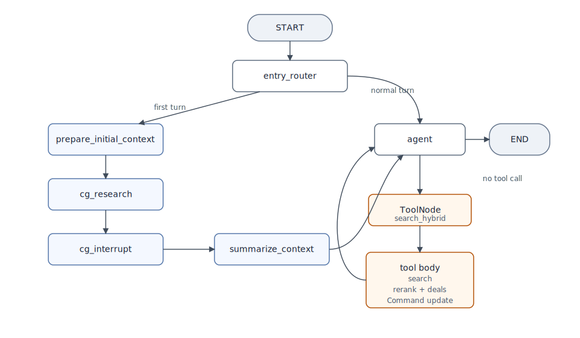
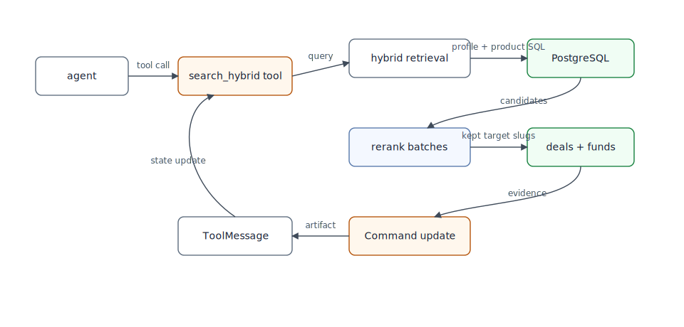
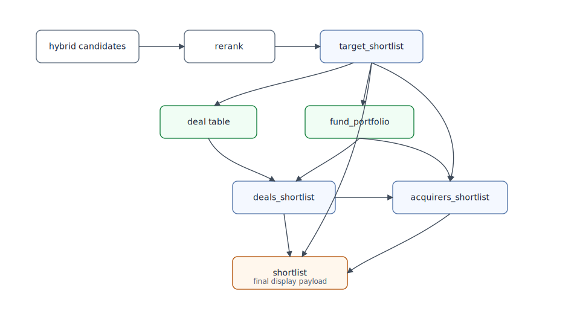
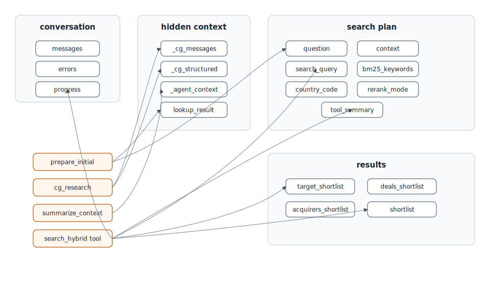
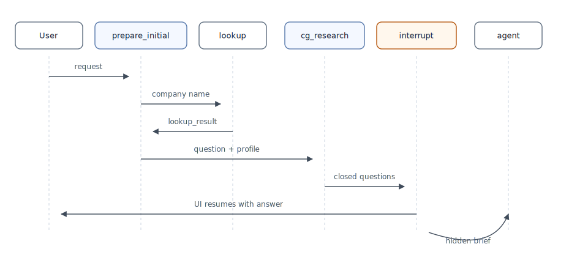
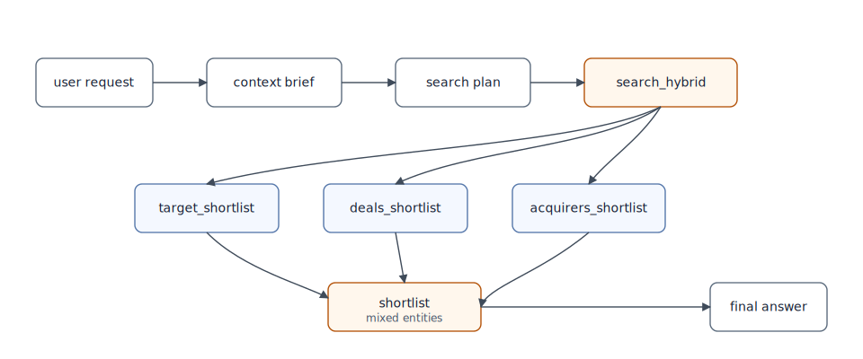

# `pe_deal` Deal Discovery Graph

This document explains how the `pe_deal` LangGraph works end to end.

`pe_deal` is the deal discovery graph that turns a user request about a company or market into a set of comparable target companies, related deals, and potential acquirers. It is downstream of the company-research problem solved by `pe_qa`, but the current implementation can also start from a first-turn buyer-search request and build its own target-market context before searching.

The intended reader is a new engineer who needs to understand, debug, or extend `pe_deal` without reverse-engineering the codebase from scratch.

## Code Map

The graph is spread across a small set of files:

- Graph topology: [`pe_deal_graph/graph.py`](../../pe_deal_graph/graph.py)
- State schema and reducers: [`pe_deal_graph/state.py`](../../pe_deal_graph/state.py)
- Main agent, tool schema, first-turn setup, and context handoff: [`pe_deal_graph/nodes/mainAgent.py`](../../pe_deal_graph/nodes/mainAgent.py)
- Context generator and interrupt flow: [`pe_deal_graph/nodes/context_generator.py`](../../pe_deal_graph/nodes/context_generator.py)
- Hybrid target retrieval: [`pe_deal_graph/nodes/search.py`](../../pe_deal_graph/nodes/search.py)
- Reranking, deal loading, acquirer derivation, and final shortlist assembly: [`pe_deal_graph/nodes/rerank.py`](../../pe_deal_graph/nodes/rerank.py)
- First-turn company lookup: [`pe_deal_graph/nodes/lookup.py`](../../pe_deal_graph/nodes/lookup.py)
- BM25, product formatting, and summary helpers: [`pe_deal_graph/nodes/utils.py`](../../pe_deal_graph/nodes/utils.py)
- Main-agent and rerank prompts: [`pe_deal_graph/llm/prompt.py`](../../pe_deal_graph/llm/prompt.py)
- OpenAI and embedding client helpers: [`pe_deal_graph/llm/client.py`](../../pe_deal_graph/llm/client.py)
- Local SQL templates for retrieval, deals, funds, and acquirers: [`pe_deal_graph/db/sql_templates.py`](../../pe_deal_graph/db/sql_templates.py)
- Local PostgreSQL pool helper: [`pe_deal_graph/db/connection.py`](../../pe_deal_graph/db/connection.py)

## Diagram Set

The Mermaid files are the editable sources of truth. The SVG files are committed so the documentation remains readable even where Mermaid rendering is unavailable.

| Diagram | SVG | Mermaid source |
| --- | --- | --- |
| Full graph overview | [graph-overview.svg](assets/graph-overview.svg) | [graph-overview.mmd](diagrams/graph-overview.mmd) |
| First-turn sequence | [first-turn-sequence.svg](assets/first-turn-sequence.svg) | [first-turn-sequence.mmd](diagrams/first-turn-sequence.mmd) |
| Search tool sequence | [search-tool-sequence.svg](assets/search-tool-sequence.svg) | [search-tool-sequence.mmd](diagrams/search-tool-sequence.mmd) |
| Deal enrichment flow | [deal-enrichment-flow.svg](assets/deal-enrichment-flow.svg) | [deal-enrichment-flow.mmd](diagrams/deal-enrichment-flow.mmd) |
| State map | [state-map.svg](assets/state-map.svg) | [state-map.mmd](diagrams/state-map.mmd) |
| Output lifecycle | [output-lifecycle.svg](assets/output-lifecycle.svg) | [output-lifecycle.mmd](diagrams/output-lifecycle.mmd) |

## What `pe_deal` Owns

At a high level, `pe_deal` owns five jobs:

1. Understand the company or market the user is using as a buyer-search anchor.
2. Ask closed clarification questions about buyer logic and strategic fit when the first turn is ambiguous.
3. Convert that context into a hybrid retrieval query for comparable target companies.
4. Retrieve and rerank targets from the proprietary database, restricted to companies with deal or PE-backing signals.
5. Derive related deals, funds, shareholding relationships, and potential acquirers from the kept targets.

The important design detail is that `pe_deal` does not search buyers directly first. It first finds target companies in the relevant market, then uses those targets' deals and ownership relationships to identify buyers and investors with demonstrated activity in that market.

## Mental Model

There are two distinct execution paths.

### Path A: First-turn buyer-search context generation

On the very first user turn, the graph bypasses the main agent. It tries to understand the company and buyer logic first, asks clarification questions, then hands a hidden strategic brief to the agent.



This path exists because a request like "find buyers for this company" is usually too vague for retrieval. The graph needs to infer the target's market, value-chain position, and likely buyer archetypes before it searches comparable companies.

### Path B: Later agent-driven search or answer

After the first-turn context has been prepared, or when the graph already has state, execution goes directly to the main agent.

The agent can either:

- answer from the existing workflow state
- call `search_hybrid` once to refresh the target/deal/buyer pipeline

Unlike `pe_qa`, there is no compiled LangGraph search subgraph. The search, rerank, deal loading, acquirer derivation, and state update are all orchestrated inside the `search_hybrid` tool implementation.

## Topology and Routing

The graph is defined in [`pe_deal_graph/graph.py`](../../pe_deal_graph/graph.py). It has:

- one root graph
- one first-turn context branch
- one main agent
- one LangGraph `ToolNode` containing the `search_hybrid` tool

The entry condition is deliberately narrow:

- the conversation must contain exactly one `HumanMessage`
- there must be no current shortlist

If both are true, `entry_router` sends execution to the first-turn context path. Otherwise it sends execution to `agent`.

There is one resume optimization in the router:

- if `_cg_structured` already exists and `_cg_messages` already contains a user clarification answer, the graph routes straight to `summarize_context`
- this lets an interrupted first-turn run resume without re-running the context generator

## Node-by-Node Walkthrough

The table below is the shortest correct mental model of the graph.

| Node | Why it exists | Main reads | Main writes |
| --- | --- | --- | --- |
| `entry_router` | Detect whether this is a first-turn buyer-search request or a normal agent turn. | `messages`, `shortlist`, `_cg_structured`, `_cg_messages` | no durable state |
| `prepare_initial_context` | Seed the first-turn flow and try to resolve the user's company reference. | latest user message, current shortlist | `question`, cleared `_cg_messages`, cleared `_cg_structured`, cleared `_agent_context`, optional `lookup_result` |
| `cg_research` | Run a web-assisted context generator that frames buyer logic and clarification questions. | `question`, `lookup_result` | `_cg_messages`, `_cg_structured`, `user_language` |
| `cg_interrupt` | Surface clarification questions to the UI and suspend the graph until the user answers. | `_cg_messages`, `_cg_structured` | appends the user's clarification answer to `_cg_messages` |
| `summarize_context` | Convert the context-generator exchange into hidden state for the main agent. | `_cg_messages`, `_cg_structured` | `_agent_context` |
| `agent` | Decide whether to answer directly or call `search_hybrid`, then write the final answer after the tool result. | `messages`, `_agent_context`, search/deal/buyer state | AI response in `messages`, cleared `_agent_context`, `user_language`, `progress` |
| `tools` | Execute the `search_hybrid` LangChain tool call requested by the agent. | latest tool call, runtime state | `ToolMessage`, `context`, query fields, all shortlist fields, `tool_summary`, `progress`, `errors` |

### `entry_router`

Purpose: decide whether the graph should build buyer-search context first or let the agent act immediately.

Why it matters:

- It makes first-turn behavior deterministic.
- It prevents the main agent from guessing the market before the target context has been clarified.
- It lets interrupted first-turn runs resume from `summarize_context` when the clarification answer already exists.

### `prepare_initial_context`

Purpose: set up the first-turn context path and optionally attach a known company profile.

What it does:

- extracts the latest human message into `question`
- clears stale context-generator state
- calls `lookup()` directly
- stores the returned company profile in `lookup_result` when a match is found

The embedded lookup helper checks:

1. the current shortlist
2. direct fuzzy lookup in `company_linkedin_data`
3. trigram similarity fallback
4. LLM name-normalization fallback

If a company is found, the result is enriched with legal and financial helper data before it is passed into the context generator.

### `cg_research`

Purpose: produce a strategic buyer-search context and closed clarification questions.

Implementation details:

- It uses the Responses API through `web_search_reasoning_parse(...)`.
- The model is hardcoded to `gpt-5.2`.
- `web_search_preview` is required, not optional.
- The output is parsed into the `CGResearchOutput` schema.

This node writes two layers of data:

- `_cg_messages`: a synthetic mini-conversation between the original request and the generated clarification prompt
- `_cg_structured`: target-market summary, clarification questions, market summary, and company-card fields

The prompt also asks for buyer-fit details, but the current Pydantic schema does not include a `buyer_fit_summary` field. That means buyer-fit text is prompt intent, not persisted structured state.

### `cg_interrupt`

Purpose: stop the graph and let the user answer the clarification questions.

The node:

- finds the latest context-generator assistant message
- calls `interrupt(...)` with both the rendered prompt and structured questions
- resumes when the caller provides an answer
- appends that answer into `_cg_messages`

This is the only place where the graph intentionally suspends execution for user input.

### `summarize_context`

Purpose: prepare hidden context for the main agent after the clarification round.

What gets packed into `_agent_context`:

- a verbatim transcript of the context-generator exchange
- an internal market context block containing:
  - target market summary
  - broader market summary
  - company-card fields for core product, upstream, core, and downstream

No visible `ToolMessage` is appended during this handoff. The context is injected into the next agent call as a system message named `INTERNAL CONTEXT GENERATOR BRIEF`.

### `agent`

Purpose: decide whether to answer directly or trigger the search/deal pipeline, then produce the final user-facing answer after the tool result.

The agent runs in two modes:

- planning mode: web search and `search_hybrid` are available
- answer mode: tool use is disabled after the last message is a `ToolMessage` named `search_hybrid`

The prompt in [`pe_deal_graph/llm/prompt.py`](../../pe_deal_graph/llm/prompt.py) forces several behaviors:

- answer in the latest user language
- use existing workflow state for follow-up questions when sufficient
- call `search_hybrid` only when a new or refreshed search is needed
- build a compact English `search_query`
- provide 4 to 8 English BM25 keywords when possible
- keep `country_code` as an explicit, single-country HQ filter
- avoid optimizing target retrieval for M&A words like acquisition, buyer, investor, or transaction unless those are part of the market definition

### `search_hybrid` tool

Purpose: run the full target-to-buyer pipeline and update graph state in one tool return.

The tool is defined in [`pe_deal_graph/nodes/mainAgent.py`](../../pe_deal_graph/nodes/mainAgent.py), not in the graph topology file.

Its internal sequence is:

1. normalize `country_code`
2. call `run_hybrid_search(...)`
3. call `rerank_results(...)`
4. build a compact tool summary
5. return a `Command` that appends a `ToolMessage` and updates all result state

The `ToolMessage` artifact contains the full result payload:

- `shortlist`
- `target_shortlist`
- `deals_shortlist`
- `acquirers_shortlist`
- `errors`

## Search Tool Internals



The `search_hybrid` tool contains the real retrieval and deal-discovery logic. It has one normal path; there is no current shortlist-filter-only path.

### Hybrid target retrieval

Target retrieval is handled in [`pe_deal_graph/nodes/search.py`](../../pe_deal_graph/nodes/search.py).

The normal path is:

1. Generate one embedding from `search_query`.
2. Normalize and escape BM25 keywords.
3. Build two BM25 queries:
   - profile BM25 over `company_linkedin_data`
   - product BM25 over `company_products`
4. Run profile and product hybrid SQL queries in parallel.
5. Merge companies by `linkedin_slug`, summing RRF scores when a company appears in both paths.
6. Enrich the merged shortlist with `products_services`.

Both SQL paths restrict the universe to companies where:

- `has_deal = TRUE`, or
- `is_pe_backed = TRUE`

That restriction is central to the graph's behavior. `pe_deal` is biased toward companies that can produce deal and ownership evidence, not all companies in the database.

### Hybrid retrieval mechanics

The normal hybrid path uses two local SQL templates from [`pe_deal_graph/db/sql_templates.py`](../../pe_deal_graph/db/sql_templates.py):

- `HYBRID_SEARCH_PROFILES`
- `HYBRID_SEARCH_PRODUCTS`

Both queries combine:

- vector retrieval
- ParadeDB BM25 retrieval
- reciprocal rank fusion

Current constants:

- `RRF_K = 60.0`
- `VECTOR_WEIGHT = 1.5`
- `BM25_WEIGHT = 0.7`
- `VECTOR_DISTANCE_THRESHOLD = 0.90`
- `BM25_SCORE_THRESHOLD = 1.0`
- `PRODUCT_VECTOR_OVERSAMPLE = 2000`

The product path has a subtle implementation detail:

- product vectors are retrieved from `company_products`
- company-level filters are applied after the join back to `company_linkedin_data`

This is why the code builds separate filter slots for profile and product search.

### Country filtering

The tool schema accepts a single optional `country_code`.

The agent-side normalization accepts only one unique value from `SUPPORTED_COUNTRY_CODES`. If the value is unsupported, empty, or contains more than one country, the filter is dropped.

When the filter is valid:

- profile search adds `AND $4 = ANY(country_codes)`
- product search adds `AND $4 = ANY(cwd.country_codes)` after joining back to companies

There is no default country filter. The prompt tells the model to use a country filter only when the user explicitly asks for one.

### Reranking

Reranking is handled in [`pe_deal_graph/nodes/rerank.py`](../../pe_deal_graph/nodes/rerank.py).

Key behaviors:

- model: `gpt-4.1-mini`
- batch size: 15 companies
- output: keep/discard decision with a reason per company
- failure mode: keep the whole batch on rerank error

The reranker preserves the incoming order. It does not resort companies; it only removes rows, adds `rerank_reason`, and assigns `target_rank`.

## Deal and Acquirer Enrichment



After target reranking, `rerank_results(...)` derives three result layers.

### `target_shortlist`

This is the reranked list of companies that matched the target-market search. Each kept company receives:

- `rerank_reason`
- `target_rank`
- original company profile fields
- optional `products_services`
- optional `deals` attached later

This list is the basis for deal lookup and acquirer derivation.

### `deals_shortlist`

Deals are loaded from two sources.

First, real deal rows are loaded from the `deal` table for the kept target `linkedin_slug` values.

Second, synthetic shareholding deals are built from `fund_portfolio` rows returned by `SELECT_INVESTORS_FOR_TARGETS`. These rows are marked with:

- `deal_origin = "shareholding"`
- `is_synthetic = True`
- `deal_type` such as `shareholding_current` or `shareholding_previous`

Rows whose acquirer name normalizes to `management` are excluded.

### `acquirers_shortlist`

Potential buyers are derived from:

- funds linked to real deals through `deal_fund`
- direct `deal.fund_id` links
- name-only fallback entries for real deal acquirers without fund metadata
- current or previous shareholders from `fund_portfolio`

Acquirer entries aggregate:

- fund metadata
- linked deals
- shareholding targets
- target companies connected to the acquirer
- relation sources such as `deal`, `shareholding_current`, or `shareholding_previous`
- ranking signals inherited from the best matching target

### `shortlist`

The final `shortlist` is assembled by `_build_final_shortlist(...)`.

This is not simply the same as `acquirers_shortlist`. It is a final display payload that can contain:

- target entities, especially for non-build-up deals
- buyer entities, especially for `build_up` deals
- entity roles such as `target` and `buyer`
- source deals
- build-up evidence
- shareholder relationships
- flags such as `is_under_lbo` and `has_sector_build_up`
- a generated `shortlist_rationale`

This mixed-entity design is useful for UI display, but it is easy to misread if you expect `shortlist` to mean only target companies or only buyers.

## State Lifecycle



The state schema lives in [`pe_deal_graph/state.py`](../../pe_deal_graph/state.py). The fields are easier to understand if grouped by role.

### Visible conversation state

| Field | Producer | Consumer | Notes |
| --- | --- | --- | --- |
| `messages` | agent, `search_hybrid` tool | agent, routing helpers | Uses `add_messages`, so updates append instead of replace |
| `errors` | search, rerank, tool payload | agent, UI/debugging | Replaced, not appended |
| `progress` | agent, `search_hybrid` tool | UI/debugging | Last-known step/status payload |

### Hidden context-generator state

| Field | Producer | Consumer | Notes |
| --- | --- | --- | --- |
| `_cg_messages` | `cg_research`, `cg_interrupt` | `summarize_context`, router | Uses a special reducer where `[]` means reset |
| `_cg_structured` | `cg_research` | `summarize_context`, router | Structured target-market context |
| `_agent_context` | `summarize_context` | `agent` | Hidden context injected as a system message |
| `lookup_result` | `prepare_initial_context` via `lookup()` | `cg_research` | First-turn company profile seed |
| `user_language` | `cg_research`, `agent` | `agent`, prompt injection | Used to force response language |

### Search-plan state

| Field | Producer | Consumer | Notes |
| --- | --- | --- | --- |
| `question` | `prepare_initial_context`, `agent`, `search_hybrid` tool | rerank, summaries, UI/debugging | Human-readable search brief |
| `context` | `search_hybrid` tool, caller-provided state | agent | Merged tool context and optional caller context |
| `search_query` | `search_hybrid` tool | agent state prompt | Compact English semantic query |
| `bm25_keywords` | `search_hybrid` tool | agent state prompt | Lexical retrieval hints |
| `country_code` | `search_hybrid` tool | agent state prompt, retrieval | Single explicit HQ country filter |
| `rerank_mode` | `search_hybrid` tool | rerank state compatibility | Currently always set to `balanced` by the tool |
| `tool_summary` | `search_hybrid` tool | final agent answer | Compact summary of targets, deals, and buyers |

### Result state

| Field | Producer | Consumer | Notes |
| --- | --- | --- | --- |
| `target_shortlist` | `rerank_results(...)` | agent, UI, deal enrichment | Kept target companies after rerank |
| `deals_shortlist` | `rerank_results(...)` | agent, UI, acquirer derivation | Real and synthetic deal/shareholding rows |
| `acquirers_shortlist` | `rerank_results(...)` | agent, UI, summary helper | Aggregated potential buyers |
| `shortlist` | `_build_final_shortlist(...)` | agent, UI | Final mixed target/buyer display payload |

## Models, Tools, and Prompt Responsibilities

| Stage | Implementation | Model / tool | Responsibility |
| --- | --- | --- | --- |
| Context generator | Responses API parse | `gpt-5.2` + required `web_search_preview` | Understand the company, market, value chain, and buyer archetypes |
| Main agent planning | `ChatOpenAI(...).bind_tools(...)` | `gpt-5.4` + `web_search` + `search_hybrid` | Decide whether to answer or run a new target/deal/buyer search |
| Final answer after tool result | plain `ChatOpenAI` invoke | `gpt-5.4` | Produce the visible answer without issuing more tools |
| Reranker | structured output through `ChatOpenAI` | `gpt-4.1-mini` | Per-target keep/discard verification |
| Lookup normalization fallback | `chat_json(...)` | `gpt-4.1-mini` | Guess canonical company spelling if direct lookup fails |
| Embeddings | LangChain embeddings | `text-embedding-3-large` with 1536 dims | Semantic retrieval for the target-market query |

### Where web search happens

Web search happens in two places:

1. `cg_research`, where it is mandatory and internal to the context generator.
2. `agent`, where it is available in planning mode if the market or terminology still needs refinement.

The target retrieval, rerank, deal loading, and acquirer derivation code paths do not perform web search.

### Prompt split by responsibility

The prompts are specialized:

- context-generator prompt: define the target's market, value-chain position, buyer archetypes, and clarification questions
- agent prompt: decide whether to search, build the target retrieval plan, and keep language/output aligned with the user
- rerank prompt: make target-company keep/discard relevance decisions from company and product evidence

This split is why the graph searches target companies first and derives buyers only after the target universe is credible.

## Data Dependencies

The graph is tightly coupled to PostgreSQL, ParadeDB, pgvector, and a few shared helper modules.

### Main tables touched by `pe_deal`

| Table | Used by | Purpose |
| --- | --- | --- |
| `company_linkedin_data` | lookup, profile search, product join-back, acquirer metadata | Canonical company profile table |
| `company_products` | product hybrid search, product enrichment | Product/service evidence for retrieval and rerank |
| `ca_estimates_linkedin` | retrieval SQL joins | Revenue estimate fields attached to company rows |
| `deal` | deal enrichment | Real transaction rows for kept targets |
| `deal_fund` | acquirer enrichment | Link table between deals and funds |
| `fund` | acquirer enrichment, shareholding enrichment | Fund and investor metadata |
| `fund_portfolio` | synthetic shareholding deals, shareholder display | Current and previous fund ownership relationships |
| legal and financial helper tables | first-turn lookup enrichment | Legal, executive, and financial context for a matched company |

### Shared modules used by the graph

| Module | Main symbols used | Why it matters |
| --- | --- | --- |
| [`shared/db/sql_templates.py`](../../shared/db/sql_templates.py) | `WEBSITE_FUZZY_MATCH`, `WEBSITE_TRIGRAM_MATCH` | Lookup fallback SQL |
| [`shared/db/legal.py`](../../shared/db/legal.py) | `enrich_single_with_legal(...)` | Enriches the first-turn company lookup |
| [`shared/db/financials.py`](../../shared/db/financials.py) | `get_actes(...)` | Adds Actes-style financial data during lookup |
| [`shared/db/connection.py`](../../shared/db/connection.py) | `get_pool("linkedin")` | Used only by lookup, while search/deal retrieval uses the local `pe_deal_graph` pool |

## Worked Traces

### Trace 1: First user turn asking for buyers



Example request:

> "Find potential buyers for Skello."

Execution shape:

1. `entry_router` detects first turn and routes to `prepare_initial_context`.
2. `prepare_initial_context` tries to resolve "Skello" through `lookup()`.
3. `cg_research` runs web-assisted company and market understanding.
4. `cg_interrupt` asks 2 to 3 closed clarification questions about buyer logic.
5. The caller resumes the graph with the user's answer.
6. `summarize_context` writes the transcript and structured market brief into `_agent_context`.
7. `agent` consumes the hidden brief and calls `search_hybrid` if the target universe is precise enough.
8. `search_hybrid` retrieves comparable target companies, reranks them, loads deals, derives acquirers, and updates all shortlist fields.
9. `agent` writes the final answer while the UI can display the result tables separately.

Operationally, the first visible assistant message may come from the context generator, not the main agent.

### Trace 2: Follow-up search refresh

Example request after results already exist:

> "Limit this to France and focus on buyers with HR software build-up logic."

Execution shape:

1. `entry_router` routes directly to `agent`.
2. `agent` inspects the current workflow state.
3. Because the user added material constraints, the agent calls `search_hybrid` again.
4. The tool normalizes `country_code = "FR"`.
5. Retrieval runs a fresh global target search with the country filter.
6. Rerank/deal/acquirer enrichment run again.
7. The previous result state is replaced by the new result state.

What matters operationally:

- this is a fresh search, not an in-memory shortlist filter
- there is no `shortlist_history` reducer in `pe_deal`
- previous results are not archived by the graph

### Trace 3: Answering from current state

Example request after results already exist:

> "Which buyers look most credible and why?"

Execution shape:

1. `entry_router` routes to `agent`.
2. `agent` receives the current workflow state, including result counts and `tool_summary`.
3. If the current state is sufficient, the agent answers directly without calling `search_hybrid`.

This is the cheap path. It relies on the last result payload and avoids a new retrieval/deal-enrichment run.

### Trace 4: Zero-result or no-buyer path

Execution shape:

1. Retrieval may return no target companies, or rerank may discard all candidates.
2. `rerank_results(...)` returns empty shortlist fields and an error such as `No results to rerank`.
3. `build_hybrid_search_summary(...)` reports zero targets, zero final entities, zero deals, and zero buyers.
4. The final agent answer should explain the empty result and suggest how to broaden the search.

This path is important because the final answer layer is still responsible for making an empty result understandable.

## Interrupts and Observability



The graph does not currently have a dedicated `stream.py` helper like `pe_qa`. Observability is mostly carried through:

- LangGraph messages and tool events
- the `interrupt(...)` payload from `cg_interrupt`
- the `progress` state field
- the compact `tool_summary`
- the four shortlist payloads

Core `progress` shapes:

| Producer | Step | Meaning |
| --- | --- | --- |
| `agent` | `answer` | The agent answered without a tool call or completed a post-tool answer |
| `agent` | `agent` | The agent requested tool execution |
| `search_hybrid` tool | `search_hybrid` | The full target/deal/buyer pipeline completed |

The most important runtime behavior is the interrupt:

- the graph suspends inside `cg_interrupt`
- the UI or caller is responsible for resuming execution with the user's answer
- the graph continues from `summarize_context` or directly from the interrupted node depending on the runtime resume shape

## Known Constraints and Gotchas

These are the implementation details most likely to surprise a new engineer.

### 1. The graph searches comparable targets before buyers

Even when the user asks for buyers, `search_hybrid` retrieves target companies first. Buyers are derived from those targets' deals and shareholding relationships.

### 2. The first turn does not start at the agent

The graph intentionally bypasses the main agent on the first user turn when there is no shortlist. If you debug only the agent prompt, you will miss the actual first-turn behavior.

### 3. `search_hybrid` is an agent tool, not a compiled search subgraph

There are no LangGraph nodes for embedding, hybrid search, rerank, deal loading, or acquirer derivation. Those steps happen inside the tool call and return as one `Command` update.

### 4. There is no shortlist-filter mode

Unlike `pe_qa`, a follow-up constraint in `pe_deal` triggers a fresh retrieval if the agent decides a new search is needed. The current code does not apply in-memory filters to an existing shortlist and does not maintain `shortlist_history`.

### 5. The target search universe is deal-biased

Both profile and product retrieval require `has_deal = TRUE OR is_pe_backed = TRUE`. This is appropriate for deal discovery, but it means the graph will miss companies that match the market but have no deal or PE-backing signal.

### 6. `country_code` is single-country only

The tool schema describes one optional country code, and `_normalize_country_code(...)` drops multi-country values. If the user asks for France and Italy, the backend currently cannot represent that as a structured filter.

### 7. Country assumptions differ between prompts and backend

The context-generator prompt says the database only contains companies in France, Italy, and Switzerland. The agent-side supported country list includes many European country codes. The SQL layer applies no default geography when `country_code` is absent.

### 8. `rerank_context` is currently not used by the rerank prompt

The tool accepts `rerank_context`, and `rerank_results(...)` passes it down, but `build_rerank_user_prompt(...)` does not interpolate it into the prompt. As written, rerank decisions use `search_context` and company evidence, not the extra context field.

### 9. `buyer_fit_summary` is prompt-only right now

The context-generator prompt asks for `buyer_fit_summary`, but `CGResearchOutput` does not define that field. The structured state currently stores target-market summary, clarification questions, market summary, and company card only.

### 10. Embedding failure falls back to a zero vector

If `embed_query(...)` fails, search continues with a zero vector and BM25 still runs. This protects availability, but relevance can degrade without a hard failure.

### 11. Rerank failures fail open

If a rerank batch errors, every company in that batch is kept with `rerank error - kept by default`. This protects recall, but it can make weak results look valid.

### 12. `shortlist` is a mixed final payload

The final `shortlist` can contain target entities and buyer entities. Use `entity_type` and `entity_roles` before assuming what a row represents.

### 13. `management` acquirers are excluded

Investor/acquirer rows whose normalized name is `management` are filtered out. This avoids clutter from management buyout labels, but it can hide real management-led situations.

### 14. Lookup uses shared DB helpers while search uses local DB helpers

`lookup.py` imports shared connection and SQL helpers, while target retrieval and deal enrichment use `pe_deal_graph/db`. This split is intentional in the current code but easy to miss when debugging connection behavior.

## How to Regenerate the Diagrams

If you update any Mermaid source file in `diagrams/`, regenerate the SVGs so the committed visuals remain in sync.

Use the helper script:

```bash
./docs/pe-deal-graph/render-diagrams.sh
```

The script expects `mmdc` from Mermaid CLI to be installed locally and writes SVGs into `docs/pe-deal-graph/assets/`.

## Checklist for Future Changes

When you change `pe_deal`, revisit this document if the change affects any of the following:

- first-turn routing conditions
- context-generator output schema
- clarification interrupt payload
- agent tool set or model assignment
- `search_hybrid` tool schema
- country-filter semantics
- hybrid SQL templates
- target universe restrictions
- rerank prompt inputs or failure behavior
- deal and shareholding enrichment
- final shortlist entity shape
- `progress` field names or meanings

If one of those changes moves, the graph can still work while this document quietly becomes misleading.
